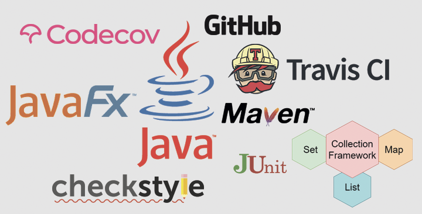

# Программист Вдовиченко Виктор
> Начал стажировку на курсе Java разработчика http://job4j.ru 
> Ниже перечислены проекты, реализованые мной во время стажировки. 
> Проекты будут добавляться по мере реализации.

## Уровень "Джуниор"
> Изученные блоки в процессе стажировки.

[Блок 1 - Структуры данных и алгоритмы.](./doc/DataStructures.md) 
* Инструменты и среда разработки.
* **Iterator**. Изучение шаблона **Iterator** описываемый интерфейсом `java.util.Iterator`.
* **Generic**. 
* **List**. Структура данных – список, описывается интерфейсом `List`.
* **Set**. Всё что касается интерфейса `Set` и его наиболее употребительными реализациями.
* **Map**. Одна из самых часто используемых структур данных – **HashMap**.
* **Tree**. Изучение структуры - деревья.

~~[Блок 2. Ввод-вывод](#)~~

~~[Блок 3. SQL, JDBC](#)~~

~~[Блок 4. Garbage Collection](#)~~

~~[Блок 5. ООД](#)~~

## Изученные технологии на данном этапе
 
	
## [Лицензия](https://github.com/ViktorJava/job4j/tree/master/LICENSE)
MIT

<mark>Free Software, Hell Yeah!</mark>

---

>e-mail:[gmail.com](mailto:gipsyscrew@gmail.com) &nbsp;&middot;&nbsp;
>fb:[Facebook.com](https://www.facebook.com/viktor.vdovichenko) &nbsp;&middot;&nbsp;
> GitHub:[@ViktorJava](https://github.com/ViktorJava) &nbsp;&middot;&nbsp;
> OK:[Odnoklassniki](https://ok.ru/profile/571539586668)

